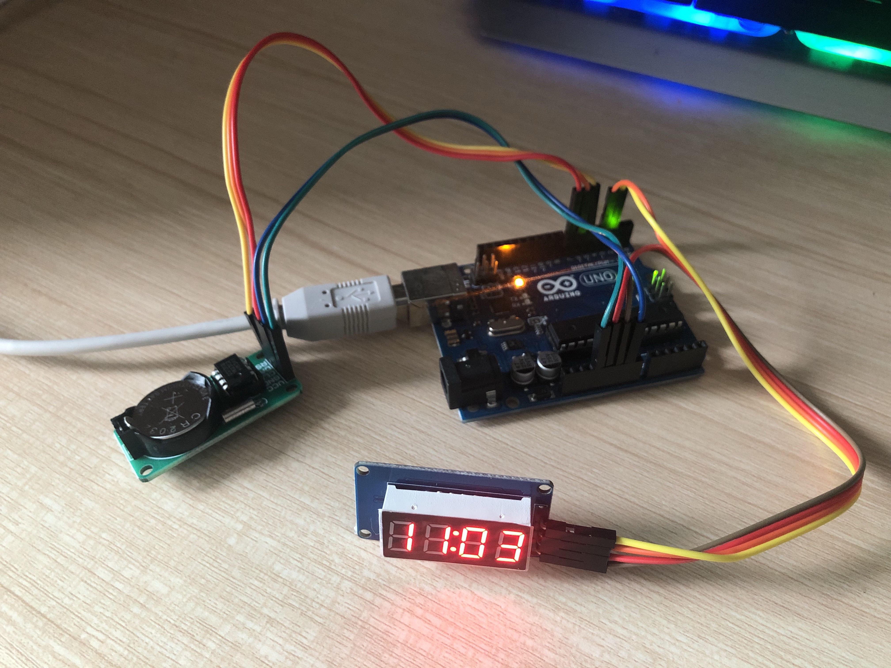

# ClockForSeg

> RTC(DS1302)와 7-세그먼트(TM1637)을 이용해 보다 쉽게 시계를 만들 수 있도록 돕는 라이브러리 입니다.

[ENGLISH VERSION](https://github.com/jihoonkimtech/ClockForSeg_Lib/blob/master/README.md)

<br>

<!-- NPM Version -->
<!-- Build Status -->
[](https://www.ardu-badge.com/ClockForSeg_Lib)<br>
[![NPM Version][npm-image]][npm-url]    [![Build Status][travis-image]][travis-url]

MIT 라이센스를 따릅니다. ( ``LICENSE`` 파일에서 더 많은 정보를 찾을 수 있습니다. ) 

<br>

## 기능과 사용 방법

### 코드
#### 라이브러리 불러오기
- 아두이노의 라이브러리 폴더에 설치시
```C++
    #include <ClockForSeg.h>
```
- 소스코드와 동일한 폴더에 설치시
```C++
    #include <"ClockForSeg_Lib/ClockForSeg.h">
```
#### 객체 생성
```C++
    ClockForSeg clocks(RTC_CLK, RTC_DAT, RTC_RST, SEG_DIO, SEG_CLK);
    // clocks는 객체 이름입니다.
```

#### 기능
- init (void);
```C++
    clocks.init();
    //DS1302, TM1637의 초기 설정
```

- displayTime (int _mode);
```C++
    clocks.displayTime(BLINK);
    //":"를 계속 깜빡인 채로 유지
    //유지 시간 : 킨 상태로 500ms, 끈 상태로 500ms

    clocks.displayTime(NON_BLINK);
    //":"를 킨 채로 유지
    //유지 시간 : 킨 상태로 1000ms
```

<br>

### Hardware
- 아래의 모델을 지원합니다.
    - `DS1302` (데이터시트 파일 : /doc/HCSR04.pdf)
    - `TM1637` (데이터시트 파일 : /doc/HCSR04.pdf)
- 아래의 보드를 지원합니다.
    - 실사용 테스트 완료.
        - `Arduino UNO`
        - `Arduino MEGA`
        - `Arduino NANO`
    - 사용 가능 예상.
        - `All boards using Arduino IDE`

<br>

## 사용 예제
코드 예제를 통해 사용 방법을 자세히 설명합니다.
_더 많은 예제와 사용법은 ``Exemples`` 폴더를 참고하세요._

<br>

## 업데이트 내역

* 1.0.0
    * 첫 정식 버전
    * 개발 종료
    * 아두이노 라이브러리 매니저 등록
* 0.0.1 (demo)
    * 개발 시작 

<br>

## 정보
### 제작자
- Jihoon Kim ([jihoonkimtech](https://jihoonkimtech.github.io/), [jihoonkimtech@naver.com](mailto:jihoonkimtech@naver.com))


<!-- Markdown link & img dfn's -->
[npm-image]: https://img.shields.io/npm/v/datadog-metrics.svg?style=flat-square
[npm-url]: https://npmjs.org/package/datadog-metrics
[npm-downloads]: https://img.shields.io/npm/dm/datadog-metrics.svg?style=flat-square
[travis-image]: https://img.shields.io/travis/dbader/node-datadog-metrics/master.svg?style=flat-square
[travis-url]: https://travis-ci.org/dbader/node-datadog-metrics
[wiki]: https://github.com/yourname/yourproject/wiki
