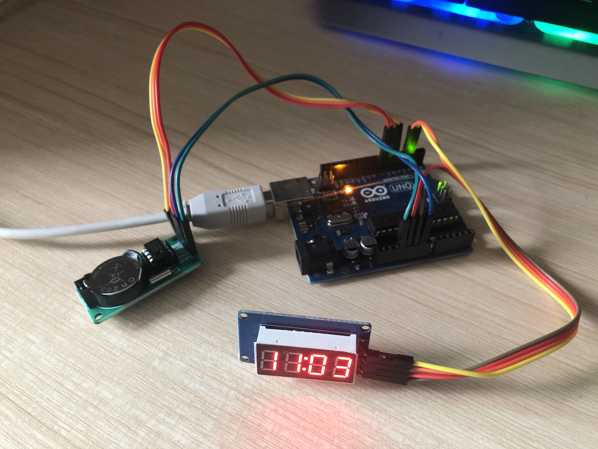

# ClockForSeg

>  A library for Clock made of TM1637, DS1302

[KOREAN VERSION](https://github.com/jihoonkimtech/ClockForSeg_Lib/blob/master/README_kor.md)

<br>

<!-- NPM Version -->
<!-- Build Status -->
[](https://www.ardu-badge.com/ClockForSeg_Lib)<br>
[![NPM Version][npm-image]][npm-url]    [![Build Status][travis-image]][travis-url]

Follows the MIT license ( Please check ``LICENSE`` file for more information. ) 

<br>

## Function and How to Use

### Code
#### Library Import
- in case of Library file in Arduino/Library folder
```C++
    #include <ClockForSeg.h>
```
- In case of Library file in Source code file
```C++
    #include <"ClockForSeg_Lib/ClockForSeg.h">
```
#### Create Object
```C++
    ClockForSeg clocks(RTC_CLK, RTC_DAT, RTC_RST, SEG_DIO, SEG_CLK);
    // clock is object name
```

#### Function
- init (void);
```C++
    clocks.init();
    //initialize DS1302, TM1637
```

- displayTime (int _mode);
```C++
    clocks.displayTime(BLINK);
    //Keep Blinking ":"
    //Delays : turn on 500ms, turn off 500ms

    clocks.displayTime(NON_BLINK);
    //keep ":" on
    //Delays : turn on 1000ms
```

<br>

### Hardware
- Supports the models below.
    - `DS1302` (datasheet in /doc/HCSR04.pdf)
    - `TM1637` (datasheet in /doc/HCSR04.pdf)
- The boards below are supported.
    - Test Finished.
        - `Arduino UNO`
        - `Arduino MEGA`
        - `Arduino NANO`
    - Support Forecast
        - `All boards using Arduino IDE`

<br>

## Example

_The contents of the example are see ``Exemples`` folder._

<br>

## Update History

* 1.0.1
    * Change depends library
* 1.0.0
    * First official version
    * Develop Finished
    * Register with Library Manager.
* 0.0.1 (demo)
    * Start of Develop. 

<br>

## Information
### Maker
- Jihoon Kim ([jihoonkimtech](https://jihoonkimtech.github.io/), [jihoonkimtech@naver.com](mailto:jihoonkimtech@naver.com))


<!-- Markdown link & img dfn's -->
[npm-image]: https://img.shields.io/npm/v/datadog-metrics.svg?style=flat-square
[npm-url]: https://npmjs.org/package/datadog-metrics
[npm-downloads]: https://img.shields.io/npm/dm/datadog-metrics.svg?style=flat-square
[travis-image]: https://img.shields.io/travis/dbader/node-datadog-metrics/master.svg?style=flat-square
[travis-url]: https://travis-ci.org/dbader/node-datadog-metrics
[wiki]: https://github.com/yourname/yourproject/wiki
